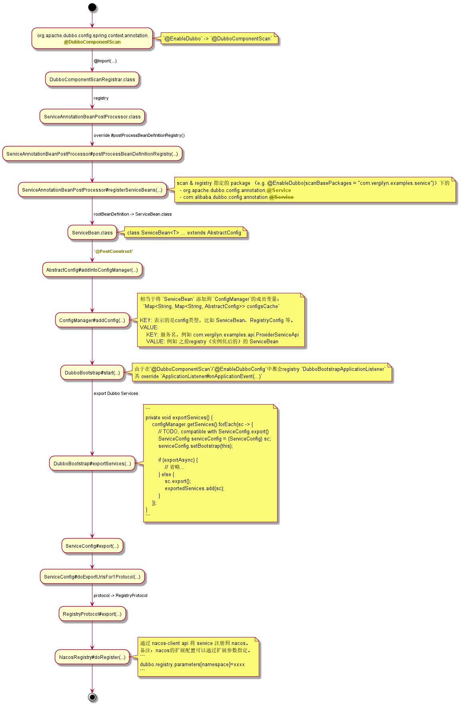

# 【001】provider 启动过程

+ [服务导出（服务注册）](http://dubbo.apache.org/zh-cn/docs/source_code_guide/export-service.html)


             

## 2. `vergilyn-provider-examples`

```JAVA
package com.vergilyn.examples.config;

import org.apache.dubbo.config.ProviderConfig;
import org.apache.dubbo.config.spring.context.annotation.EnableDubbo;
import org.springframework.context.annotation.Bean;
import org.springframework.context.annotation.Configuration;
import org.springframework.context.annotation.PropertySource;

@Configuration
@EnableDubbo(scanBasePackages = "com.vergilyn.examples.service")
@PropertySource("classpath:/dubbo-provider.properties")
public class ProviderAutoConfiguration {

    @Bean
    public ProviderConfig providerConfig() {
        ProviderConfig providerConfig = new ProviderConfig();
        providerConfig.setTimeout(1000);
        return providerConfig;
    }
}
```

`dubbo-provider.properties`:
```
dubbo.application.name=${spring.application.name}
dubbo.registry.address=nacos://127.0.0.1:8848
dubbo.protocol.name=dubbo
dubbo.protocol.port=20880
```

### 2.1 FAQ


#### 2.1.2 `java.lang.IllegalStateException: No such extension org.apache.dubbo.rpc.Protocol by name dubbo`
```
2020-03-09 21:14:11.560 ERROR 10504 --- [           main] o.s.boot.SpringApplication               : Application run failed

java.lang.IllegalStateException: No such extension org.apache.dubbo.rpc.Protocol by name dubbo
	at org.apache.dubbo.common.extension.ExtensionLoader.findException(ExtensionLoader.java:599) ~[classes/:na]
	at org.apache.dubbo.common.extension.ExtensionLoader.createExtension(ExtensionLoader.java:606) ~[classes/:na]
	at org.apache.dubbo.common.extension.ExtensionLoader.getExtension(ExtensionLoader.java:405) ~[classes/:na]
	at org.apache.dubbo.config.ServiceConfig.findConfigedPorts(ServiceConfig.java:644) ~[classes/:na]
	at org.apache.dubbo.config.ServiceConfig.doExportUrlsFor1Protocol(ServiceConfig.java:444) ~[classes/:na]
	at org.apache.dubbo.config.ServiceConfig.doExportUrls(ServiceConfig.java:325) ~[classes/:na]
	at org.apache.dubbo.config.ServiceConfig.doExport(ServiceConfig.java:300) ~[classes/:na]
	at org.apache.dubbo.config.ServiceConfig.export(ServiceConfig.java:206) ~[classes/:na]
	at org.apache.dubbo.config.bootstrap.DubboBootstrap.lambda$exportServices$15(DubboBootstrap.java:916) ~[classes/:na]
	at java.util.HashMap$Values.forEach(HashMap.java:981) ~[na:1.8.0_201]
	at org.apache.dubbo.config.bootstrap.DubboBootstrap.exportServices(DubboBootstrap.java:904) ~[classes/:na]
	at org.apache.dubbo.config.bootstrap.DubboBootstrap.start(DubboBootstrap.java:744) ~[classes/:na]
	...
```

因为`dubbo-provider.properties`中配置了`dubbo.protocol.name = dubbo`，  
但是未依赖其实现`org.apache.dubbo.rpc.protocol.dubbo.DubboProtocol`：  
```xml
<dependency>
    <groupId>org.apache.dubbo</groupId>
    <artifactId>dubbo-rpc-dubbo</artifactId>
    <version>${revision}</version>
</dependency>
```

#### 2.1.3 `org.apache.dubbo.rpc.RpcException: Unsupported server type: netty...`
```
org.apache.dubbo.rpc.RpcException: Unsupported server type: netty, url: dubbo://127.0.0.1:20880/com.vergilyn.examples.api.ProviderServiceApi
?anyhost=true&application=dubbo-provider-application&bind.ip=127.0.0.1&bind.port=20880
&channel.readonly.sent=true&codec=dubbo&deprecated=false&dubbo=2.0.2&dynamic=true&generic=false
&heartbeat=60000&interface=com.vergilyn.examples.api.ProviderServiceApi&methods=sayHello,sayGoodbye&pid=9528
&release=&revision=1.0.0&sayGoodbye.retries=0&sayGoodbye.return=true&sayGoodbye.timeout=250&side=provider
&timeout=1000&timestamp=1583763120764&version=1.0.0
	at org.apache.dubbo.rpc.protocol.dubbo.DubboProtocol.createServer(DubboProtocol.java:341) ~[classes/:na]
	at org.apache.dubbo.rpc.protocol.dubbo.DubboProtocol.openServer(DubboProtocol.java:320) ~[classes/:na]
	at org.apache.dubbo.rpc.protocol.dubbo.DubboProtocol.export(DubboProtocol.java:303) ~[classes/:na]
	at org.apache.dubbo.rpc.protocol.ProtocolListenerWrapper.export(ProtocolListenerWrapper.java:62) ~[classes/:na]
	at org.apache.dubbo.rpc.protocol.ProtocolFilterWrapper.export(ProtocolFilterWrapper.java:153) ~[classes/:na]
	at org.apache.dubbo.rpc.Protocol$Adaptive.export(Protocol$Adaptive.java) ~[classes/:na]
	at org.apache.dubbo.registry.integration.RegistryProtocol.lambda$doLocalExport$2(RegistryProtocol.java:244) ~[classes/:na]
	at java.util.concurrent.ConcurrentHashMap.computeIfAbsent(ConcurrentHashMap.java:1660) ~[na:1.8.0_201]
	at org.apache.dubbo.registry.integration.RegistryProtocol.doLocalExport(RegistryProtocol.java:242) ~[classes/:na]
	at org.apache.dubbo.registry.integration.RegistryProtocol.export(RegistryProtocol.java:199) ~[classes/:na]
	at org.apache.dubbo.rpc.protocol.ProtocolListenerWrapper.export(ProtocolListenerWrapper.java:60) ~[classes/:na]
	at org.apache.dubbo.rpc.protocol.ProtocolFilterWrapper.export(ProtocolFilterWrapper.java:151) ~[classes/:na]
	at org.apache.dubbo.rpc.Protocol$Adaptive.export(Protocol$Adaptive.java) ~[classes/:na]
	at org.apache.dubbo.config.ServiceConfig.doExportUrlsFor1Protocol(ServiceConfig.java:492) ~[classes/:na]
	at org.apache.dubbo.config.ServiceConfig.doExportUrls(ServiceConfig.java:325) ~[classes/:na]
	at org.apache.dubbo.config.ServiceConfig.doExport(ServiceConfig.java:300) ~[classes/:na]
	at org.apache.dubbo.config.ServiceConfig.export(ServiceConfig.java:206) ~[classes/:na]
	at org.apache.dubbo.config.bootstrap.DubboBootstrap.lambda$exportServices$15(DubboBootstrap.java:916) ~[classes/:na]
	at java.util.HashMap$Values.forEach(HashMap.java:981) ~[na:1.8.0_201]
	at org.apache.dubbo.config.bootstrap.DubboBootstrap.exportServices(DubboBootstrap.java:904) ~[classes/:na]
	at org.apache.dubbo.config.bootstrap.DubboBootstrap.start(DubboBootstrap.java:744) ~[classes/:na]
```

同`2.1.2`的原因一样，
未依赖其实现类`org.apache.dubbo.remoting.transport.netty4.NettyTransporter`：  
```xml
<dependency>
    <groupId>org.apache.dubbo</groupId>
    <artifactId>dubbo-remoting-netty4</artifactId>
    <version>${revision}</version>
</dependency>
```

#### 2.1.4 


#### 2.1.5 metadata `release`为 null的问题？
- org.apache.dubbo.config.ServiceConfig#doExportUrls()
- --> org.apache.dubbo.config.AbstractInterfaceConfig.appendRuntimeParameters
- --> org.apache.dubbo.common.Version#getVersion()

`org.apache.dubbo.config.ReferenceConfig#createProxy() -> Version.getVersion()` 返回null


TODO

#### 2.1.6 Map属性无法绑定 例如`dubbo.registry.parameters.namespace=xxx`无法绑定到 RegistryConfig#parameters
+ [issues#2301](https://github.com/apache/dubbo/issues/2301)
+ [issues#4342](https://github.com/apache/dubbo/issues/4342)
+ [issues#4899](https://github.com/apache/dubbo/pull/4899)
+ [配置加载流程](http://dubbo.apache.org/zh-cn/docs/user/configuration/configuration-load-process.html)
- com.alibaba.spring.beans.factory.annotation.ConfigurationBeanBindingPostProcessor#bindConfigurationBean()
- org.springframework.beans.MutablePropertyValues (spring-beans-5.2.2.RELEASE.jar)

```properties
dubbo.application.parameters.item1=value1
dubbo.application.parameters.item2=value2

# issues#4899 中提到的另外语法（dubbo v2.7.4+）
dubbo.application.parameters=[{item1:value1}, {item2:value2}]
```

可以获取当`dubbo-provider.properties`中的配置参数，但无法绑定到 `RegistryConfig#parameters`

查看issues貌似2.7.4解决，但个人在 2.7.6.release 下依然有问题，待排查。

2020-03-16 >>>>  
```properties
# spring-beans v5.2.2.RELEASE 中正确的语法
dubbo.application.parameters[item1]=value1
dubbo.application.parameters[item2]=value2
```
