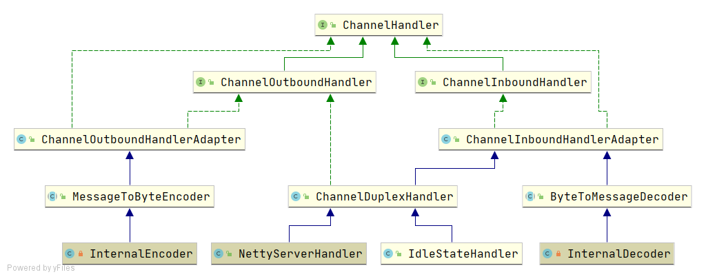
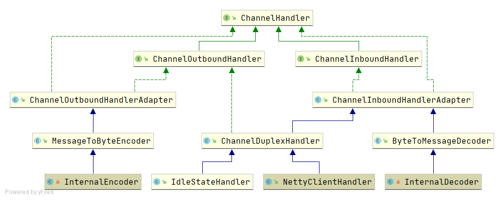

# 【003】dubbo 中的netty4.MD


## 1. NettyServer
```java
package org.apache.dubbo.remoting.transport.netty4;

public class NettyServer extends AbstractServer implements RemotingServer {
    private ServerBootstrap bootstrap;
    private EventLoopGroup bossGroup;
    private EventLoopGroup workerGroup;

    public NettyServer(URL url, ChannelHandler handler) throws RemotingException {
        // you can customize name and type of client thread pool by THREAD_NAME_KEY and THREADPOOL_KEY in CommonConstants.
        // the handler will be wrapped: MultiMessageHandler->HeartbeatHandler->handler
        super(ExecutorUtil.setThreadName(url, SERVER_THREAD_POOL_NAME), ChannelHandlers.wrap(handler, url));
    }

    @Override
    protected void doOpen() throws Throwable {
        final org.apache.dubbo.remoting.transport.netty4.NettyServerHandler nettyServerHandler = 
                    new NettyServerHandler(getUrl(), this);

        bootstrap.group(bossGroup, workerGroup)
         .childHandler(new ChannelInitializer<SocketChannel>() {
                        @Override
                        protected void initChannel(SocketChannel ch) throws Exception {
                            ch.pipeline()
                                    // inbound           
                                    .addLast("decoder", adapter.getDecoder()) 
                                    // outbound
                                    .addLast("encoder", adapter.getEncoder())
                                    // inbound & outbound
                                    .addLast("server-idle-handler", 
                                                new IdleStateHandler(0, 0, idleTimeout, MILLISECONDS))  
                                    // inbound & outbound
                                    .addLast("handler", nettyServerHandler);
                        }
                    });
    }
}
```



### 1.1 NettyServerHandler
通过netty知识可知，netty-server处理netty-client的主要逻辑是由`NettyServerHandler`实现。

```java
// final NettyServerHandler nettyServerHandler = new NettyServerHandler(getUrl(), this);
package org.apache.dubbo.remoting.transport.netty4;

@io.netty.channel.ChannelHandler.Sharable
public class NettyServerHandler extends ChannelDuplexHandler {
    private final URL url;
    private final ChannelHandler handler;
    
    /**
     * <p>vergilyn-comment, 2020-03-31 >>>> <br/>
     *   有且仅存在该 constructor
     * </p>
     * @param url
     * @param handler {@linkplain NettyServer#doOpen()} 可知, handler 即{@linkplain NettyServer}
     */
    public NettyServerHandler(URL url, ChannelHandler handler) {
        this.url = url;
        // the handler will be wrapped(包装): MultiMessageHandler->HeartbeatHandler->handler
        this.handler = handler;
    }

    @Override
    public void channelRead(ChannelHandlerContext ctx, Object msg) throws Exception {
        NettyChannel channel = NettyChannel.getOrAddChannel(ctx.channel(), url, handler);
        handler.received(channel, msg);
    }
}
```

NettyServer.handler = new MultiMessageHandler();
MultiMessageHandler.handler = new HeartbeatHandler();
HeartbeatHandler.handler = NettyServer构造函数传入的ChannelHandler


## NettyClient
```java
package org.apache.dubbo.remoting.transport.netty4;

public class NettyClient extends AbstractClient {
    private Bootstrap bootstrap;

    @Override
    protected void doOpen() throws Throwable {
        final org.apache.dubbo.remoting.transport.netty4.NettyClientHandler nettyClientHandler = 
                            new NettyClientHandler(getUrl(), this);

        bootstrap.handler(new ChannelInitializer<SocketChannel>() {
            @Override
            protected void initChannel(SocketChannel ch) throws Exception {

                ch.pipeline()
                        // inbound
                        .addLast("decoder", adapter.getDecoder())
                        // outbound
                        .addLast("encoder", adapter.getEncoder())
                        // inbound & outbound
                        .addLast("client-idle-handler", new IdleStateHandler(heartbeatInterval, 0, 0, MILLISECONDS))
                        // inbound & outbound
                        .addLast("handler", nettyClientHandler);
            }
        });
    }
}
```

  

NettyServer#childHandler() 与 NettyClient#handler() 中关于inbound/outbound的定义差不多，
主要区别在实际的逻辑业务 handler: `NettyServerHandler`, `NettyClientHandler`。


2020-03-31 >>>> question
1. dubbo-client 如何通过rpc调用 dubbo-server？
2. dubbo-server 如何获取被处理 dubbo-client的rpc调用？